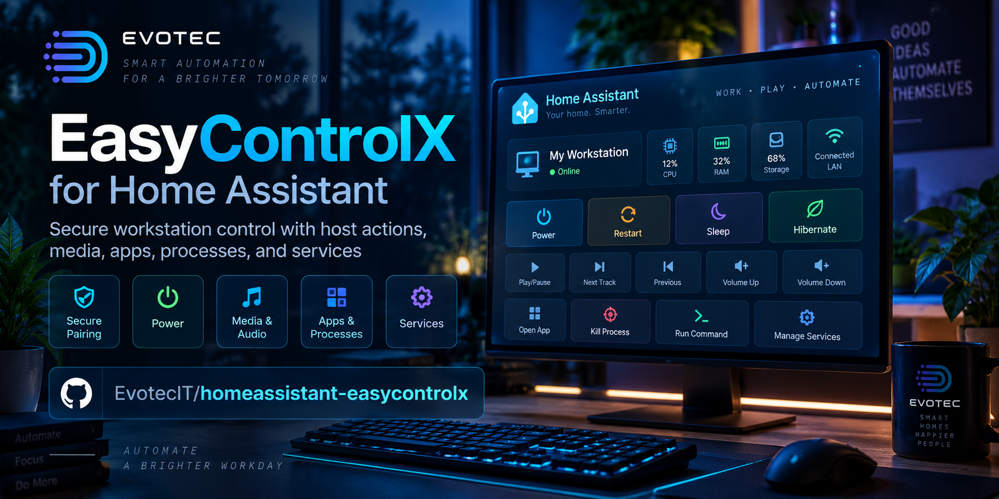

# EasyControlX for Home Assistant



*Illustrative artwork. Available controls depend on the device and integration support.*

`homeassistant-easycontrolx` is a public Home Assistant custom integration for
EasyControlX hosts.

The goal is simple: make EasyControlX the long-term replacement for brittle
Windows desktop helper stacks such as Hass.Agent-style setups, while keeping the
Home Assistant side clean, public, and easy to install.

## More for your Home Assistant home

Other projects we maintain for the same setup:

- [Dreame & MOVA mowers](https://github.com/EvotecIT/homeassistant-dreamelawnmower) — mowing controls, maps, schedules, and supported cameras.
- [Lawn Mower Card](https://github.com/EvotecIT/lovelace-lawn-mower-card) — a visual dashboard for mower state, maps, and controls.
- [KEF](https://github.com/EvotecIT/homeassistant-kef) — local control for modern and legacy speaker families.
- [Devialet](https://github.com/EvotecIT/homeassistant-devialet) — local speaker control, with Dione support.
- [Siegenia](https://github.com/EvotecIT/homeassistant-siegenia) — local control for supported window controllers.

Prefer a native app for everyday control? [CasaRay](https://casaray.dev/)
brings rooms, devices, cameras, and home activity together on iPhone, iPad, and
Mac. [Tactra Remote](https://tactra.dev/) puts media players, speakers, and TV
controls in a focused remote for iPhone, iPad, Apple Watch, and Mac.

Both connect to your Home Assistant setup. Neither is required to use this
project.

## Design Goals

- Native Home Assistant integration, not pasted YAML as the primary UX
- Public custom integration repo with a stable API boundary to EasyControlX
- Future-friendly config entries, diagnostics, reauth, and reconfigure flows
- A path to grow from host controls into a broader workstation automation stack
- No direct dependency on DesktopManager or private EasyControlX source code

## Installation

EasyControlX is available as a HACS custom repository:

1. In HACS, open the three-dot menu and choose **Custom repositories**.
2. Add `https://github.com/EvotecIT/homeassistant-easycontrolx` as an
   **Integration** repository.
3. Search for **EasyControlX**, install it, and restart Home Assistant.
4. Open **Settings → Devices & services → Add integration**, then choose
   **EasyControlX**.

Use the host's HTTPS URL. If EasyControlX uses a self-signed certificate, copy
the SHA-256 certificate fingerprint shown by the host and compare it before
continuing. You may paste an existing controller token or use the guided pairing
flow. Pairing requires both host approval and entry of the matching verification
code.

Entries created by version 0.1 are migrated from HTTP to HTTPS. If the host uses
a self-signed certificate, Home Assistant starts a repair flow so you can compare
and approve its fingerprint. The host must expose the current HTTPS API before
upgrading the integration.

Restart and shutdown deliberately remain host-side actions because they require
a real, per-action human confirmation. Home Assistant exposes Lock and Sleep,
plus safe capability-gated media, audio, app, process, file, and managed-service
controls.

## Current Scope

The integration includes:

- UI config flow
- Zeroconf discovery for `_easycontrolx._tcp.local.`
- Secure HTTPS pairing based on EasyControlX `/pair/start` and `/pair/confirm`
- Optional SHA-256 certificate pinning with explicit certificate-rotation repair
- A typed runtime-data setup with `DataUpdateCoordinator`
- Initial `sensor`, `binary_sensor`, `button`, and `camera` platforms
- Native `switch` entities for curated managed Windows services
- Per-service restart buttons for curated managed Windows services
- Per-service running-state binary sensors for inventory-only managed-service hosts
- Native Home Assistant services for power, media, audio, refresh, app launch,
  process actions, managed service actions, and file workflows
- Diagnostics with token redaction
- Options flow for polling interval and preferred preview monitor

## Future-Friendly Rules

- Keep the integration bound to the documented EasyControlX HTTP contract only
- Store setup-critical data in config-entry data and optional tuning in options
- Use the EasyControlX `deviceId` as the Home Assistant unique ID
- Add new features as new entity platforms or services without breaking existing entity IDs
- Keep runtime state in `ConfigEntry.runtime_data`
- Treat diagnostics, reauth, and reconfigure as first-class features, not cleanup work
- Keep entity creation capability-driven so Windows and macOS share one
  integration cleanly

## Replacement Strategy

This repo is meant to grow into a serious workstation integration, not just a
few power buttons. The roadmap in [`docs/ROADMAP.md`](docs/ROADMAP.md) is aimed
at replacing the common "Windows agent plus fragile custom scripts" pattern with
a more coherent host-control stack.

The shared host contract and capability namespace plan live in
[`docs/CONTRACT.md`](docs/CONTRACT.md).

The Home Assistant entity creation rules and capability-gated mapping model
live in [`docs/ENTITY_MODEL.md`](docs/ENTITY_MODEL.md).

## Development Checks

Local development and CI use:

- `ruff check .`
- `pytest -q`
- Home Assistant `hassfest` in GitHub Actions

Install all development and Home Assistant test dependencies with:

```powershell
python -m pip install -r requirements-dev.txt -r requirements-ha-tests.txt
```
